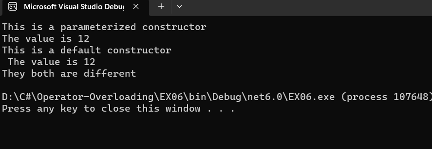

# Operator-Overloading

## Aim:
 To write a C# program to pass values through constructors(default and parameterized) and also overload equal operators by checking whether objects are equal using operator overloading. 
 
## Algorithm:
### Step 1:
Create a class operator
### Step 2:
Pass values through the constructor
### Step 3:
return the bool operator, (==) and (!=)
### Step 4:
create a object to store the return object
### Step 5:
print the program.
 
## Program:
```
using System;
namespace OperOverload
{
    class Program
    {
        int n;
        public Program(int a)
        {
            this.n = a;
            Console.WriteLine("This is a parameterized constructor");
            Console.WriteLine("The value is " + this.n);
        }
        public Program()
        {
            this.n = 12;
            Console.WriteLine("This is a default constructor \n The value is " + this.n);
        }
        public static bool operator ==(Program p1, Program p2)
        {
            return p1.Equals(p2);
        }
        public static bool operator !=(Program p1, Program p2)
        {
            return !p1.Equals(p2);
        }
        static void Main(string[] args)
        {
            Program p1 = new Program(12);
            Program p4 = new Program();
            Program p2 = p4;
            if (p2 == p4)
            {
                Console.WriteLine("They both are equal");
            }
            else if (p1 != p4)
            {
                Console.WriteLine("They both are different ");
            }
        }
    }
}


```
## Output:


## Result:
Thus a C# program to pass values through constructors(default and parameterized) and also overload equal operators by checking whether objects are equal using operator overloading executed successfully